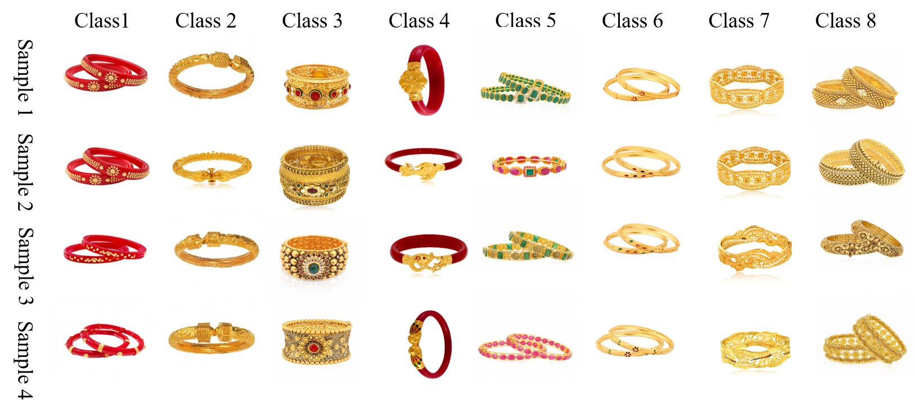

### Publication
Submitted

### Dataset Description
we have created an ornament dataset, to be specific, BangleFIR, a collection of high quality gold bangles, containing 4,379 pictures from 56 unique classes that are gathered from different web shopping destinations.

### License

Copyright © 2022 Sk Maidul Islam

The content of this repository is bound by the following licenses:

- The documents and data are licensed under the MIT license.
